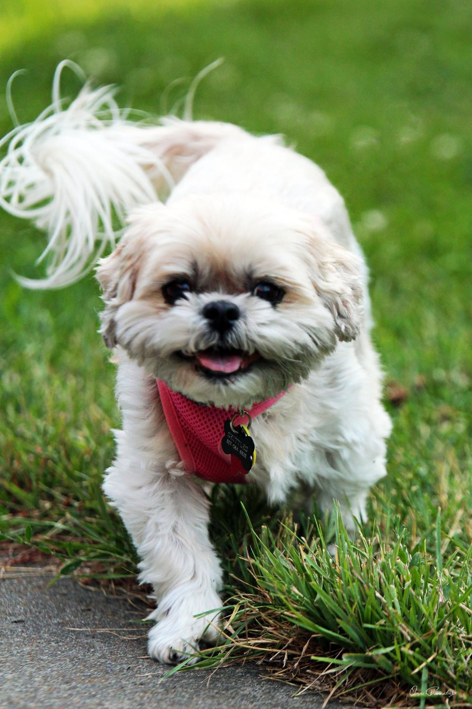
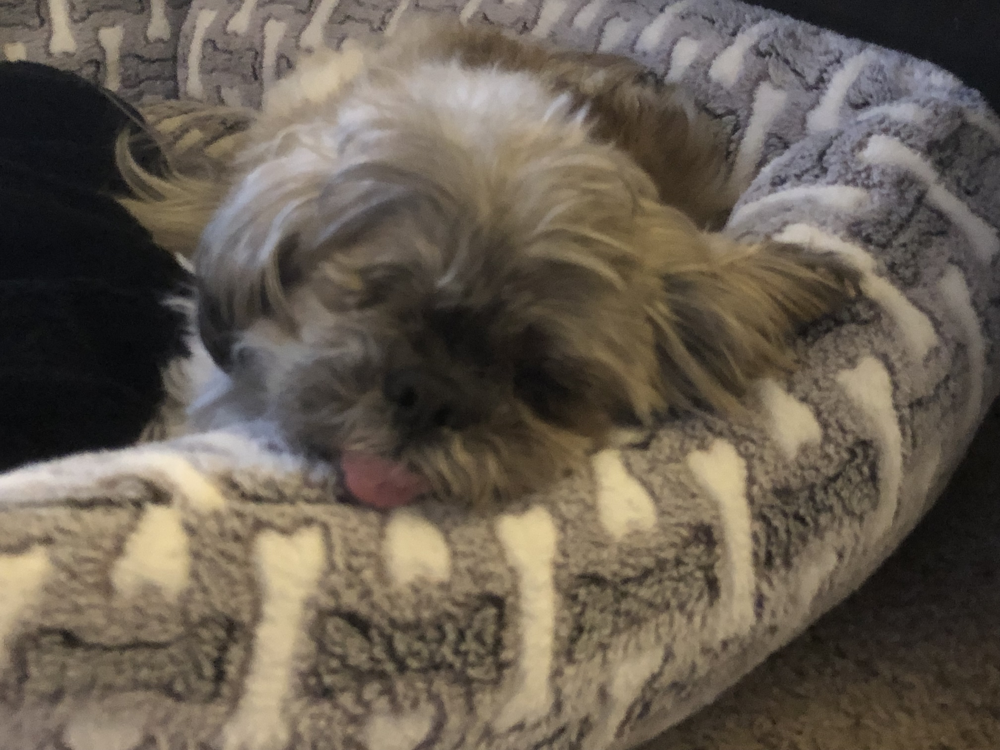
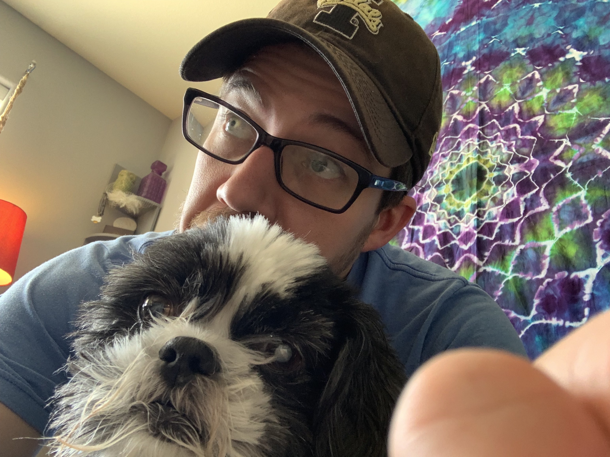
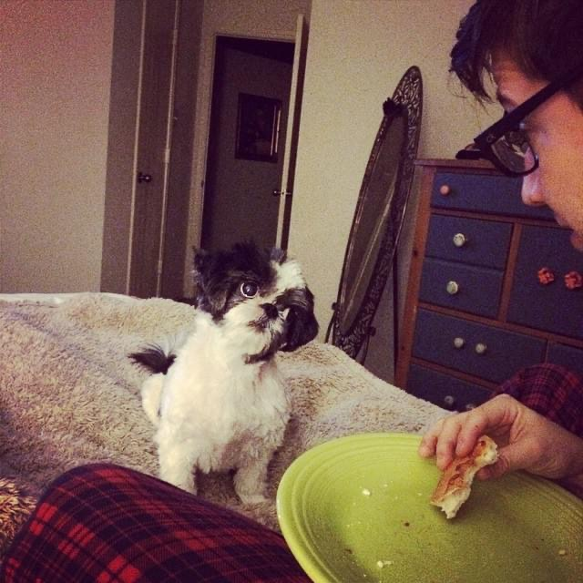
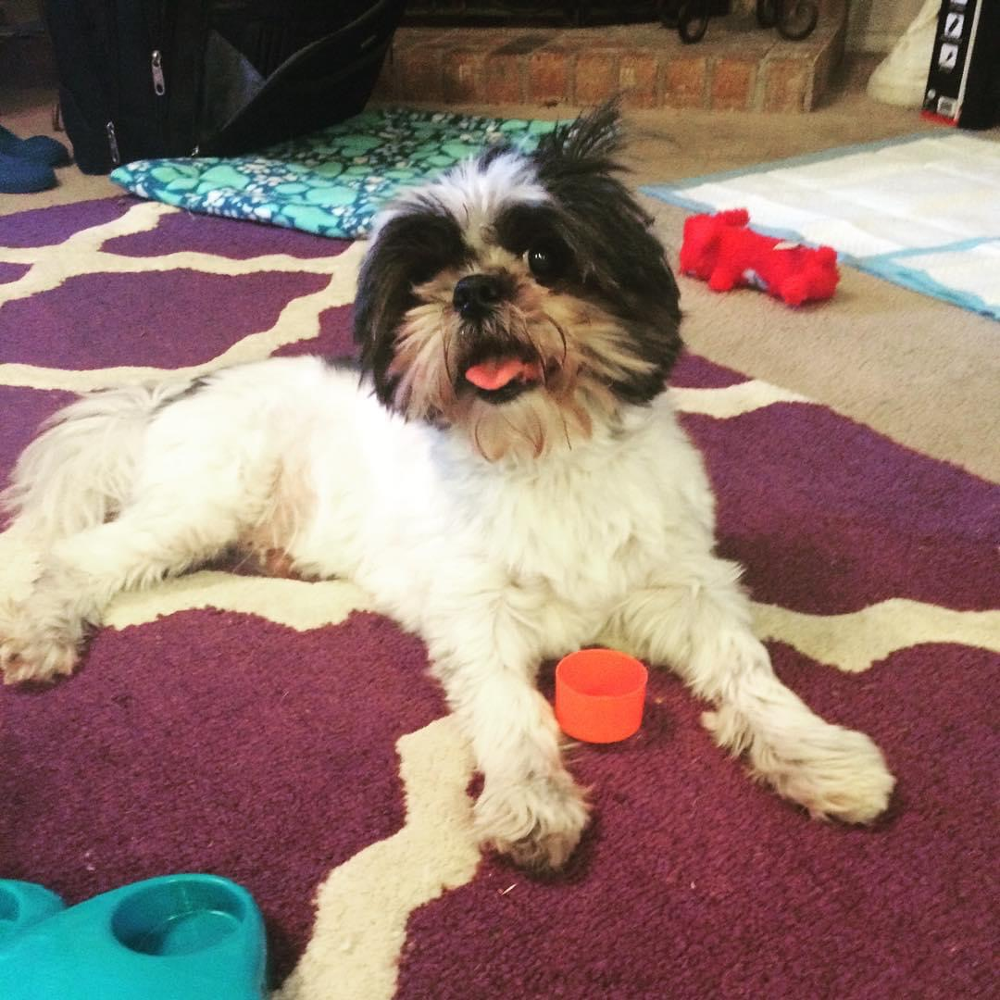

## The Rovertons!

I am the lucky husband to Tiffany--my MUCH cooler half. I mean, she works in the legal cannabis industry in Washington. She rules!

We adopt elderly Shih Tzus (hence our nickname The Rovertons), so our pack is constantly in flux. While it is difficult sometimes to say goodbye to a pup you only recently adopted, old Shih Tzus are perfect pets. They are small, lazy, (mostly) sweet, and like to cuddle all the time. 

Besides our pack we enjoy nerdy board games including Dungeons and Dragons (are you really surprised), kayaking, and consuming an absurd amount of TV. If you ever want to dish about a show on Bravo, I am here for it.

On a more serious note, I am an adult and academic with ADHD. Since I was diagnosed after receiving my PhD, I am constantly discovering what it means to have ADHD and how it affects my family, friends, students, co-workers and collaborators. I strongly believe that my ADHD has been both a gift and something that presents very real barriers to a successful professional life. 

## Meet the furry Rovertons!

